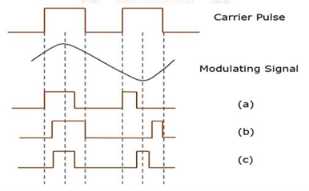
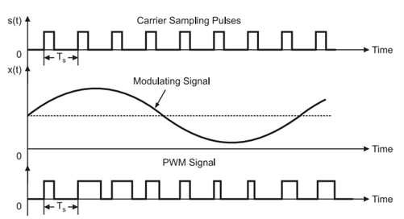
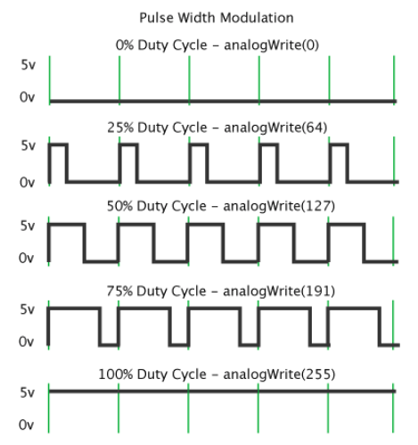
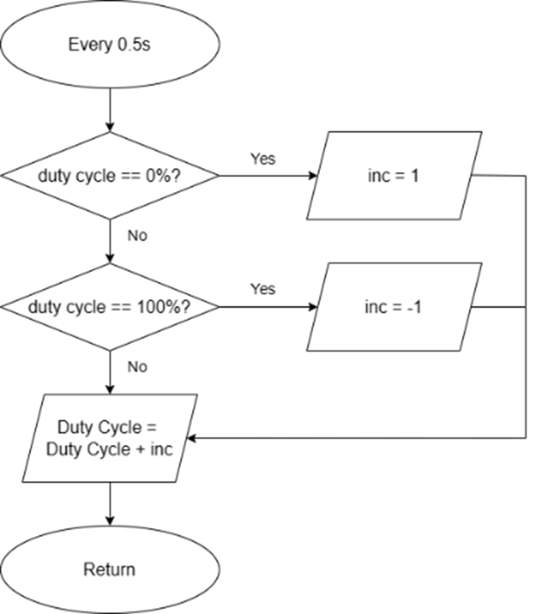
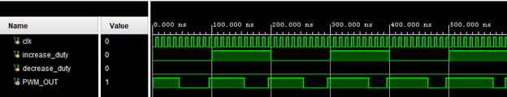
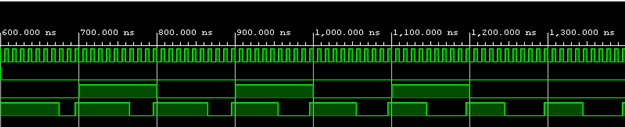

# Pulse Width Modulation Generator using Verilog HDL
<small>Last updated: 05/2023 </small>

In this project, we will create a Pulse Width Modulation (PWM) generator using Verilog HDL and implementing on the FPGA Digilent Arty Z7-20 board. 

## Table of Contents
- [Introduction](#introduction)
- [Background and Applications](#background-and-applications)
- [Block Diagram](#block-diagram)
- [Usage](#usage)
- [Simulation](#simulation)
- [Documentary and Reference](#documentary-and-reference)
- [Authors](#authors)

## Introduction

In the last two decades, the Pulse width modulation (PWM) techniques have been extensively used for controlling analog circuitry. It is more commonly used for controlling the power converters employed in various industrial/domestic applications. In power converters it is used for firing of power electronic devices like thyristors, Insulated-Gate Bipolar Transistors (IGBTS), Metal Oxide Semiconductor Field Effect Transistors (MOSFET) etc.

## Background and Applications

Pulse Width Modulation (PWM) is an analog modulating scheme in which the duration or width or time of the pulse carrier varies proportional to the instantaneous amplitude of the message signal.

The width of the pulse varies in this method, but the amplitude of the signal stays constant. Amplitude limiters are used to make the amplitude of the signal constant. These circuits clip off the amplitude, to a desired level and hence the noise is limited. The following figures explain the types of Pulse Width Modulations.

<small> Figure 1: Pulse With Modulated Waves with different time slots. </small>

In PWM, the width of the modulated pulses varies in proportion with the amplitude of modulating signal. The waveforms of PWM are shown in Figure 2 below. 

<small>Figure 2: Wave form Representation of PWM. </small>

As we can observe, the amplitude and the frequency of the PWM wave remain constant. Only the width changes. That is why the information is contained in the width variation. This is similar to FM. As the noise is normally additive noise, it changes the amplitude of the PWM signal. 

At the receiver, it is possible to remove these unwanted amplitude variations very easily by limiting circuits. As the information is contained in the width variation, it is unaffected by the amplitude variations introduced by the noise. Thus, the PWM system is more immune to noise than the PAM signal.

The term ‘duty cycle’ describes the proportion of 'on' time to the regular interval or 'period' of time; a low duty cycle corresponds to low power, because the power is off for most of the time. The duty cycle is expressed in percent, 100% being fully on. When a digital signal is on half of the time and off the other half of the time, the digital signal has a duty cycle of 50% and resembles a "square" wave. When a digital signal spends more time in the on state than the off state, it has a duty cycle of >50%. When a digital signal spends more time in the off state than the on state, it has a duty cycle of <50%. Figure 3 illustrates these 5 scenarios. 

<small>Figure 3 </small>

As a formula, a duty cycle may be expressed as:

$$ Duty Cycle = \frac{P \times W}{T} \times 100 $$

where D is the duty cycle, PW is the pulse width (pulse active time), and T is the total period of the signal. Thus, a 60% duty cycle means the signal is on 60% of the time but off 40% of the time. The "on time" for a 60% duty cycle could be a fraction of a second, day, or even a week, depending on the length of the period.

PWM has many applications in electronics. For example, it is used for direct current (DC) motor control in robotics, switched-mode power supply regulation, and other applications. It is also one of the primary methods of reducing the output of solar panels to that which can be utilized by a battery. In addition, PWM has been used in certain communication systems where its duty cycle has been used to convey information over a communications channel. 

Another application is in LED dimming, where the brightness of an LED can be controlled by varying the duty cycle of the PWM signal. PWM is also used in audio amplifiers to control the output power and in switch-mode power supplies to regulate the output voltage.

## Block Diagram

We can use the Block Diagram to understand how this code works: 

<small>Figure 4 </small>

## Simulation

The source code for the PWM Generator in Verilog can be found [here](source/btl.srcs/sources_1/new/PWM_Generator_Verilog.v) (PWM_Generator_Verilog.v). This code is designed to run perfectly on Vivado, including both simulation and implementation.

To test the functionality of the PWM Generator, you can use the provided simulation (test bench) file located [here](source/btl.srcs/sim_1/new/tb_PWM_Generator_Verilog.v) (tb_PWM_Generator_Verilog.v).

Here is some pictures and video (can be found [here](readme/testingOnArtyZ7-20.mp4)) of the simulation on Vivado: 

## Documentary and Reference
- R. Srivastava, Y. K. Chauhan and B. Kumar, "Generation of PWM using Verilog in FPGA," 2016 International Conference on Electrical, Electronics, and Optimization Techniques (ICEEOT), Chennai, India, 2016, pp. 4593-4597, doi: 10.1109/ICEEOT.2016.7755586.

- Tocci RJ Widmer NS Moss GL. Digital Systems: Principles and Applications. 9th ed. Upper Saddle River N.J: Pearson/Prentice Hall; 2004.

- Wikipedia contributors. (2023, March 14). Pulse-width modulation. In Wikipedia, The Free Encyclopedia. Retrieved 14:00, May 6, 2023, from [Wikipedia](https://en.wikipedia.org/w/index.php?title=Pulse-width_modulation&oldid=1144637466).

- Wikipedia contributors. (2023, February 19). Duty cycle. In Wikipedia, The Free Encyclopedia. Retrieved 13:55, May 6, 2023, from [Wikipedia](https://en.wikipedia.org/w/index.php?title=Duty_cycle&oldid=1140324907).
 

## Authors
- [@l1ttled1no](https://github.com/author1) - Nguyễn Đăng Duy
- [@CoderMongmer](https://github.com/CoderMongmer) - Bùi Thái An
- [@pnhk0511](https://github.com/pnhk0511) - Phạm Nguyễn Hải Khánh
